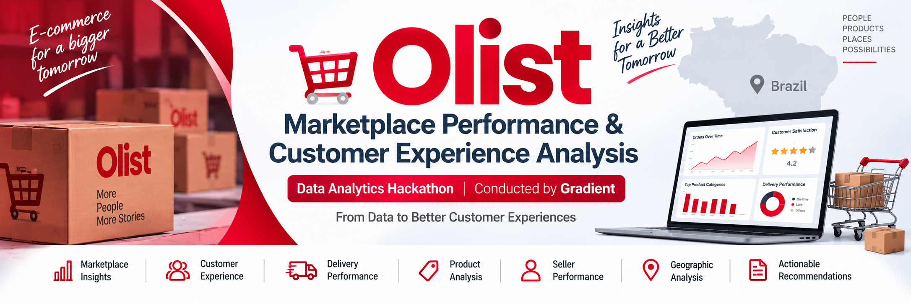
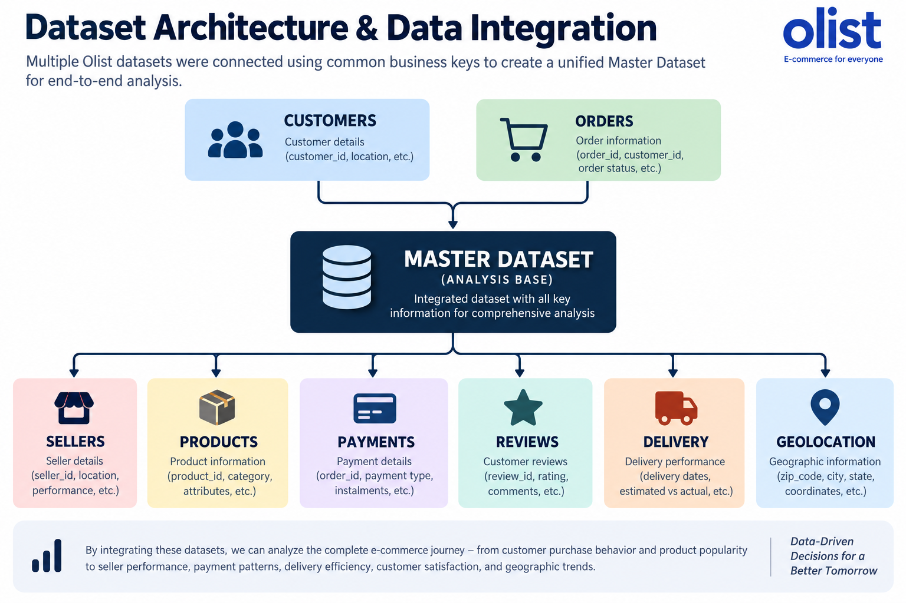
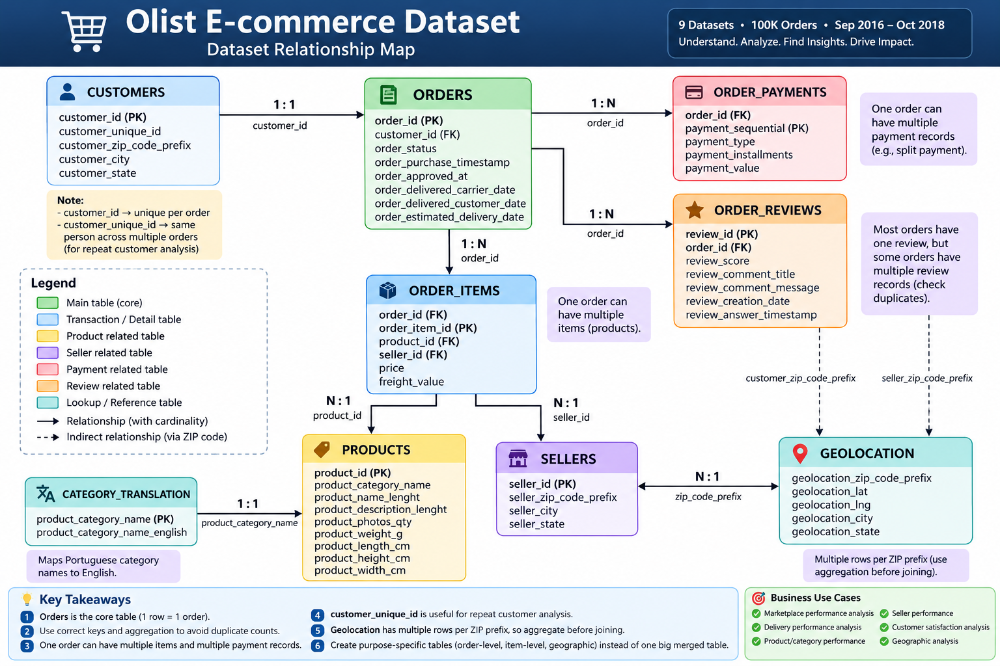
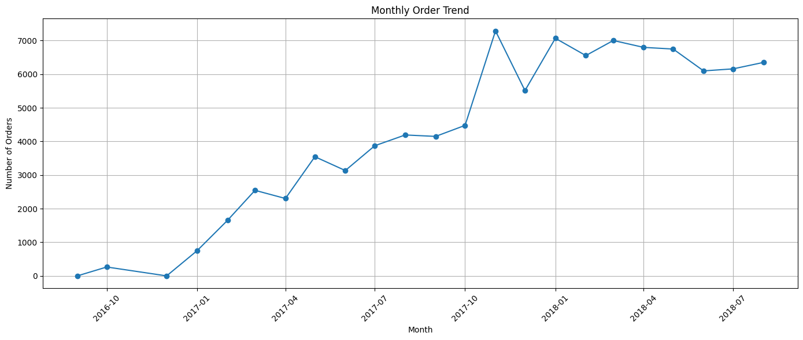
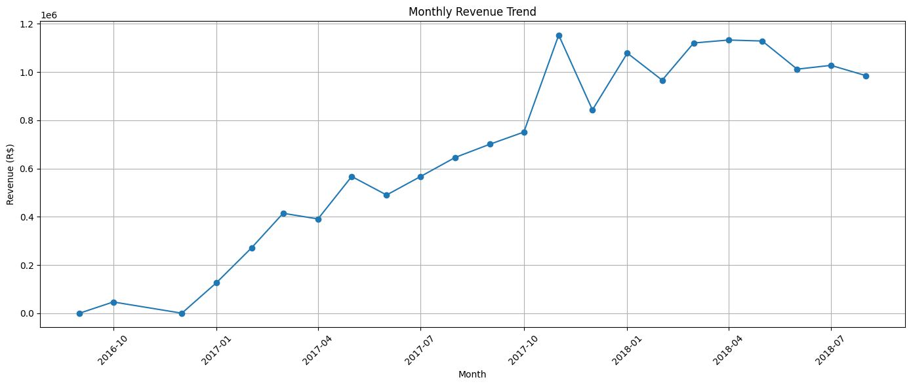
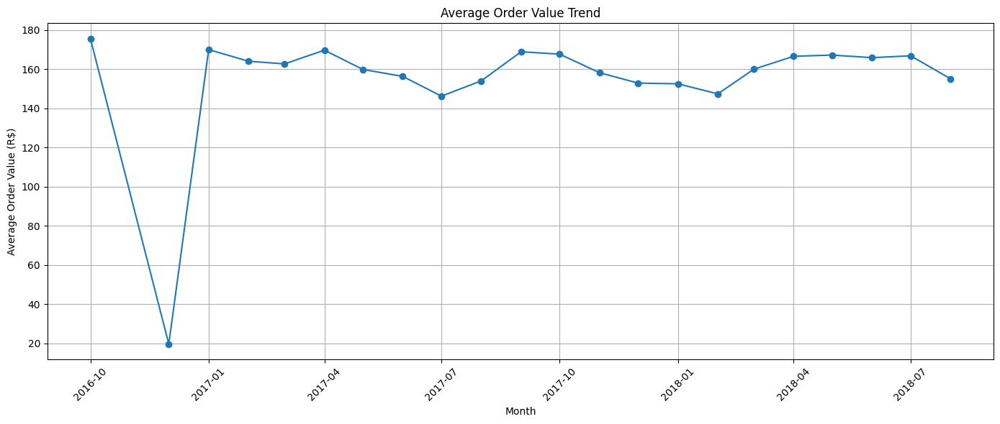
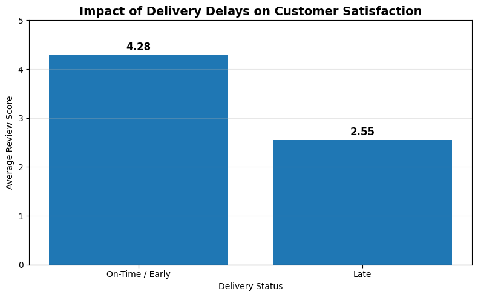
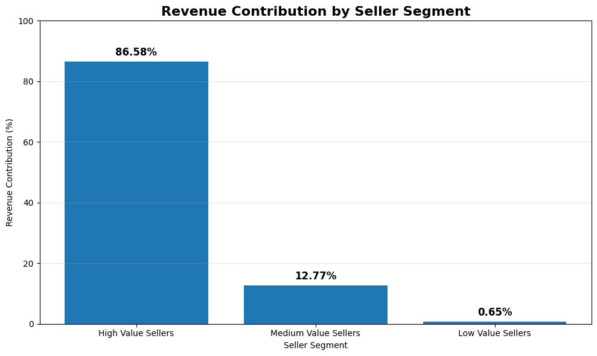
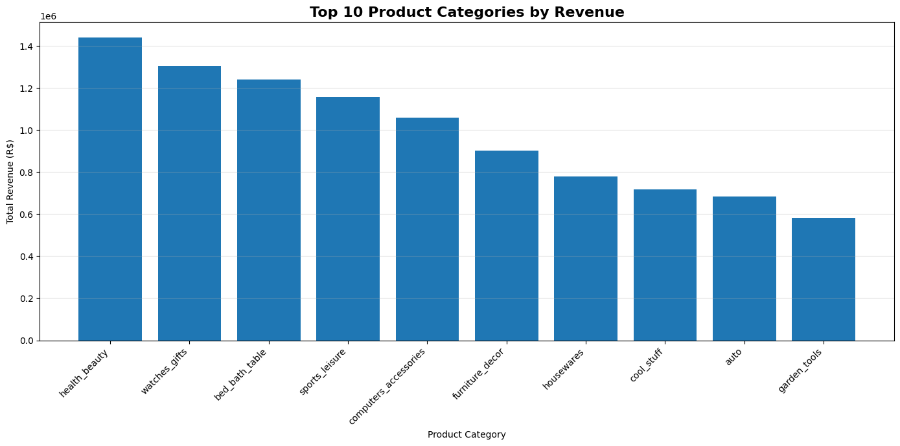

<p align="center">
  
</p>

<h1 align="center">Olist Marketplace Performance & Customer Experience Analysis</h1>

<p align="center">
  An End-to-End Data Analytics Hackathon Project analyzing marketplace performance,
  customer satisfaction, delivery operations, customer retention, seller performance,
  and business growth opportunities.
</p>

<p align="center">
  
  
  
  
  
</p>

---

# Project Overview

Olist is a Brazilian e-commerce marketplace that connects thousands of sellers with customers across the country.

This project performs an end-to-end analysis of Olist's marketplace data to understand:

- Marketplace growth
- Revenue performance
- Customer satisfaction
- Delivery performance
- Customer retention
- Seller performance
- Geographic patterns
- Product category performance

The goal of this project is to transform raw marketplace data into meaningful business insights and actionable recommendations.

---

# Business Problem

As an e-commerce marketplace grows, managing customer experience and operational performance becomes increasingly complex.

The business needs to understand:

- How is the marketplace performing over time?
- What factors are associated with low customer satisfaction?
- How does delivery performance affect customer reviews?
- Are customers returning and making repeat purchases?
- Which customers generate the highest revenue?
- How dependent is the platform on high-performing sellers?
- Which geographic regions create operational challenges?
- Where are the biggest opportunities for sustainable growth?

The objective is to use data analytics to identify important business patterns and support better operational and customer experience decisions.

---

# Project Objectives

- Analyze marketplace growth and performance
- Identify monthly order trends
- Analyze monthly revenue trends
- Study average order value
- Evaluate delivery performance
- Compare late and on-time deliveries
- Identify factors associated with customer satisfaction
- Analyze customer retention
- Identify high-value customers
- Analyze seller performance
- Explore geographic revenue patterns
- Analyze product category performance
- Perform root cause analysis
- Provide actionable business recommendations

---

# Dataset Description

The project uses the Brazilian E-Commerce Public Dataset provided by Olist.

| Attribute | Details |
|---|---|
| Domain | E-Commerce Marketplace |
| Country | Brazil |
| Analysis Period | September 2016 – October 2018 |
| Orders | Approximately 100,000 |
| Dataset Type | Relational E-Commerce Dataset |

## Major Datasets

- Customers
- Orders
- Order Items
- Products
- Sellers
- Payments
- Customer Reviews
- Geolocation

---

# Project Workflow

<p align="center">
  
</p>

```text
DATA UNDERSTANDING
        ↓
DATA CLEANING & PREPARATION
        ↓
DATA INTEGRATION
        ↓
EXPLORATORY DATA ANALYSIS
        ↓
BUSINESS ANALYSIS
        ↓
ROOT CAUSE ANALYSIS
        ↓
KEY INSIGHTS
        ↓
ACTIONABLE RECOMMENDATIONS
```

---

# Data Architecture

<p align="center">
  
</p>

The analysis combines multiple related datasets to build a comprehensive view of marketplace operations.

Key relationships include:

```text
CUSTOMERS        ORDERS
     │               │
     └──────┬────────┘
            │
       MASTER DATASET
            │
 ┌──────────┼───────────┐
 │          │           │
SELLERS   PRODUCTS   PAYMENTS
 │          │           │
REVIEWS   DELIVERY   GEOLOCATION
```

---

# Tech Stack

| Technology   | Usage                             |
| ------------ | --------------------------------- |
| Python       | Data Analysis                     |
| Pandas       | Data Cleaning and Manipulation    |
| NumPy        | Numerical Analysis                |
| Matplotlib   | Data Visualization                |
| Google Colab | Analysis Environment              |
| GitHub       | Project Hosting and Documentation |
| Canva        | Presentation Design               |

---

# Marketplace Performance Analysis

The marketplace performance analysis focused on three major metrics:

* Monthly Orders
* Monthly Revenue
* Average Order Value

---

## Monthly Order Trend

<p align="center">
  
</p>

### Key Finding

The marketplace experienced strong growth in order volume throughout the analysis period.

Order activity increased significantly during 2017 and remained at a high level during 2018, showing strong marketplace expansion.

### Business Impact

Increasing order volume indicates growing customer activity and marketplace adoption.

However, growth in transactions also increases pressure on:

* Logistics
* Delivery operations
* Sellers
* Customer support

---

## Monthly Revenue Trend

<p align="center">
  
</p>

### Key Finding

Revenue increased significantly alongside the growth in order volume.

The marketplace demonstrated strong business growth as customer activity increased.

### Business Impact

Revenue growth shows successful marketplace expansion and increasing transaction activity.

Maintaining this growth requires strong operational performance and a positive customer experience.

---

## Average Order Value Trend

<p align="center">
  
</p>

### Key Finding

Average order value remained relatively stable compared with the significant growth observed in total orders and revenue.

### Business Impact

This suggests that overall marketplace growth was primarily driven by increasing transaction volume rather than a major increase in spending per order.

---

# Delivery Performance vs Customer Satisfaction

<p align="center">
  
</p>

One of the strongest findings from the analysis was the relationship between delivery timing and customer satisfaction.

| Delivery Status        | Orders | Average Delivery Days | Average Review Score |
| ---------------------- | -----: | --------------------: | -------------------: |
| On-Time / Early Orders | 88,644 |            10.88 Days |                 4.28 |
| Late Orders            |  7,826 |            31.52 Days |                 2.55 |

## Key Finding

Late deliveries are strongly associated with significantly lower customer satisfaction.

### Review Score Difference

# 1.73 Review Score Points

Customers receiving late deliveries gave substantially lower review scores compared with customers receiving their orders on time or early.

> Delivery delays are the strongest observed factor associated with low customer satisfaction.

### Business Impact

Poor delivery performance can negatively affect:

* Customer satisfaction
* Customer trust
* Repeat purchases
* Customer retention
* Marketplace reputation

---

# Seller Performance Analysis

<p align="center">
  
</p>

## Key Finding

Approximately:

# 25% of High-Value Sellers Generate 86.58% of Total Seller Revenue

### Business Impact

The marketplace is highly dependent on a relatively small group of high-performing sellers.

This creates a potential concentration risk because losing major sellers could significantly affect marketplace revenue.

### Recommendations

* Retain and support high-value sellers
* Develop medium-value sellers
* Monitor seller performance
* Create seller improvement programs
* Reduce dependency on a small group of sellers

---

# Geographic Revenue Analysis

## Key Finding

São Paulo generates approximately:

# 37.41% of Customer Revenue

### Business Impact

São Paulo is the company's largest market.

However, heavy dependency on one geographic region creates concentration risk.

### Recommendations

* Expand into high-potential states
* Improve logistics outside São Paulo
* Increase seller availability in growth markets
* Develop region-specific growth strategies

---

# Product Category Performance

<p align="center">
  
</p>

Product categories were analyzed based on:

* Revenue
* Product Sales
* Number of Orders
* Average Product Price
* Average Freight Cost

### Business Value

This analysis helps identify:

* High-performing categories
* Major revenue contributors
* Underperforming categories
* Potential growth opportunities

---

# Customer Revenue Segmentation


## Key Finding

Approximately:

# 25% of High-Value Customers Generate 59.43% of Total Revenue

### Business Impact

A relatively small group of customers contributes significantly to overall marketplace revenue.

Losing these customers could have a major impact on business performance.

### Recommendations

* Create a VIP customer program
* Provide personalized offers
* Offer exclusive benefits
* Prioritize high-value customer retention

---

# Revenue Contribution by Payment Method

The payment method analysis helps understand how customers prefer to complete transactions and which payment channels contribute the most to marketplace revenue.

### Business Value

This insight can support:

* Payment optimization
* Customer experience improvements
* Revenue strategy
* Payment infrastructure planning

---

# Customer Retention Analysis

## Key Finding

Approximately:

# 97% of Customers Are One-Time Buyers

Only approximately:

# 3% Are Repeat Customers

### Business Impact

The marketplace has a significant opportunity to improve:

* Customer retention
* Repeat purchases
* Customer Lifetime Value
* Long-term revenue

### Recommendations

* Launch second-purchase campaigns
* Introduce loyalty programs
* Send personalized product recommendations
* Create customer reactivation campaigns

---

# Root Cause Analysis

<p align="center">
  
</p>

## Root Cause Framework

```text
GEOGRAPHIC CHALLENGES
        ↓
LOGISTICS & DELIVERY DELAYS
        ↓
LATE DELIVERIES
        ↓
LOW CUSTOMER SATISFACTION
        ↓
LOWER CUSTOMER RETENTION
```

The analysis explored multiple factors associated with low customer satisfaction.

## Major Factors Identified

* Geographic challenges
* Logistics performance
* Delivery delays
* Seller operations
* Product category differences

## Root Cause Conclusion

> Delivery reliability stands out as the strongest observed factor associated with customer satisfaction.

This does not imply direct causation, but the analysis shows a strong relationship between late deliveries and lower review scores.

---

# Key Business Findings

## 1. Customer Retention Problem

### Finding

97% of customers are one-time buyers.

### Business Impact

The company has a major opportunity to increase Customer Lifetime Value by converting one-time buyers into repeat customers.

### Recommendation

* Launch second-purchase campaigns
* Introduce loyalty programs
* Send personalized recommendations
* Create customer reactivation campaigns

---

## 2. Delivery Delays Reduce Customer Satisfaction

### Finding

Late deliveries have an average review score of **2.55**, compared with **4.28** for on-time or early deliveries.

### Business Impact

Poor delivery performance is strongly associated with lower customer satisfaction and may negatively impact customer retention.

### Recommendation

* Implement delivery delay monitoring
* Create early-warning systems
* Improve logistics in high-delay regions
* Monitor seller dispatch performance

---

## 3. High-Value Customers Are Critical

### Finding

25% of high-value customers generate approximately **59.43% of total revenue**.

### Business Impact

Losing high-value customers could significantly affect overall marketplace revenue.

### Recommendation

* Create VIP customer programs
* Provide personalized offers
* Offer exclusive benefits
* Prioritize customer retention

---

## 4. Geographic Revenue Concentration

### Finding

São Paulo generates approximately **37.41% of customer revenue**.

### Business Impact

Heavy dependency on one geographic market creates concentration risk.

### Recommendation

* Expand strategically into high-potential states
* Improve logistics infrastructure outside São Paulo
* Increase seller availability in growth markets

---

## 5. Seller Revenue Concentration

### Finding

Approximately 25% of high-value sellers generate **86.58% of total seller revenue**.

### Business Impact

The platform is highly dependent on a relatively small group of sellers.

### Recommendation

* Retain and support high-value sellers
* Develop medium-value sellers
* Improve seller performance programs
* Reduce dependency on a small number of sellers

---

# Actionable Recommendations

## Improve Delivery Performance

* Implement delivery delay monitoring
* Create early-warning systems
* Improve logistics in high-delay regions
* Monitor seller dispatch performance

---

## Improve Customer Retention

* Launch loyalty programs
* Encourage second purchases
* Create personalized recommendations
* Run customer reactivation campaigns

---

## Protect High-Value Customers

* Develop VIP programs
* Provide personalized offers
* Offer exclusive benefits
* Prioritize retention strategies

---

## Improve Seller Performance

* Monitor seller performance
* Support underperforming sellers
* Develop medium-value sellers
* Retain high-performing sellers

---

## Expand Strategically

* Identify high-potential states
* Improve regional logistics
* Increase marketplace coverage
* Reduce geographic concentration risk

---

# Final Business Strategy

```text
ACQUIRE
   ↓
DELIVER
   ↓
SATISFY
   ↓
RETAIN
   ↓
OPTIMIZE
   ↓
EXPAND
```

> Reliable Delivery → Better Customer Experience → Higher Satisfaction → Improved Retention → Sustainable Growth

---

# Repository Structure

```text
olist-marketplace-performance-analysis/
│
├── datasets/
│   └── Raw and processed Olist datasets
│
├── images/
│   ├── banner.png
│   ├── workflow.png
│   ├── ER.png
│   ├── flow.png
│   ├── average_order_value.png
│   ├── delivery_vs_satisfaction.png
│   ├── delivery.png
│   ├── monthly_revenue.png
│   ├── monthly_orders.png
│   ├── seller_performance.png
│   ├── revenue_by_states.png
│   ├── category_performance.png
│   ├── revenue_contribution_segment.png
│   └── revenue_contribution_payment_method.png
│
├── notebooks/
│   └── Olist_Marketplace_Analysis.ipynb
│
├── presentation/
│   └── Hackathon Presentation
│
├── reports/
│   └── Project Report
│
└── README.md
```

---

# Skills Demonstrated

* Data Understanding
* Data Cleaning
* Data Integration
* Exploratory Data Analysis
* Business Analysis
* Customer Segmentation
* Customer Retention Analysis
* Delivery Performance Analysis
* Seller Performance Analysis
* Geographic Analysis
* Root Cause Analysis
* Data Visualization
* Business Storytelling
* Actionable Recommendations

---

# Project Outcomes

This project successfully transformed raw e-commerce data into actionable business insights.

The analysis identified:

* Marketplace growth patterns
* Revenue trends
* Average order value trends
* Delivery performance challenges
* Customer satisfaction drivers
* Customer retention opportunities
* High-value customer segments
* Seller revenue concentration
* Geographic revenue concentration
* Product category performance
* Root causes associated with low customer satisfaction

---

# Final Conclusion

The biggest opportunity for sustainable marketplace growth is not only acquiring new customers but improving the customer experience that encourages them to return.

The company should focus on:

1. Increasing repeat purchases
2. Reducing delivery delays
3. Protecting high-value customers
4. Supporting high-value and medium-value sellers
5. Improving logistics in challenging regions
6. Expanding strategically beyond São Paulo

# Final Strategy

## ACQUIRE → DELIVER → SATISFY → RETAIN → OPTIMIZE → EXPAND

---

# Contributors

## Nitin Singh

Aspiring Data Analyst passionate about solving real-world business problems using data analytics and business intelligence.

[](https://github.com/nsr-dev-in)

[](https://www.linkedin.com/in/nsr2k06/)

---

## Pratham Meena

Data Analytics Hackathon Contributor.

---

# Hackathon

This project was developed as part of the:

## Data Analytics Hackathon

### Conducted by Gradient

---

<p align="center">
  Thank you for visiting our repository.
</p>

<p align="center">
  If you found this project interesting, consider giving it a star.
</p>

